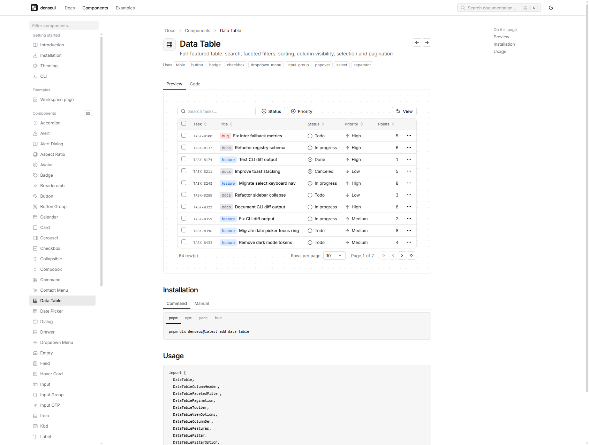

<div align="center">

# ▦ denseui

**Ultra-dense, modern UI components for serious apps.**

Copy-paste components for React, built on **Tailwind CSS v4** and **Ark UI**.<br />
Inspired by the information density of tools like Notion and Linear: 24px controls, 13px text, zero bloat.


<br />

<picture>
  <source media="(prefers-color-scheme: dark)" srcset=".github/assets/preview-dark.png" />
  
</picture>

</div>

---

## Why denseui?

Most component libraries are designed for marketing pages: 40px buttons, generous whitespace, one action per screen. **Productivity apps need the opposite.** Dashboards, admin panels, editors and internal tools must fit more on screen without feeling cramped.

denseui is built around a few strict rules:

| Rule | Value |
| --- | --- |
| Control heights | `20px` · **`24px`** · `28px` (sm / default / lg) |
| Body text | `13px`, controls `12px`, labels `11px` |
| Padding | Always `py < px`: compact, never cramped |
| Radius | `4px` controls, `8px` overlays |
| Optical centering | Line-heights tuned per size so text sits dead-center at whole pixels |
| Surfaces | Anything with a background stays opaque on hover, so nothing bleeds through |

## Features

- 🧩 **55 components**: everything you'd expect from shadcn/ui, plus a full-featured Data Table
- 🎨 **Tailwind CSS v4**: CSS-first tokens with `@theme`, no JS config
- 🌗 **Light & dark**: a modern zinc + indigo palette with deep, true dark mode
- ♿ **Accessible by default**: behavior powered by [Ark UI](https://ark-ui.com) / [Zag.js](https://zagjs.com) state machines
- 📋 **Own your code**: a CLI copies source into your project; no runtime dependency on denseui
- 🏷️ **10-color tag palette**: `bg-tag-*-bg` / `text-tag-*` for labels, statuses and badges
- 🔤 **Inter-tuned metrics**: with a metric-matched fallback so text stays centered without webfonts
- 🧭 **Framework-ready architecture**: tokens and state machines are shared, so Vue, Svelte and Solid are next
- 🤖 **AI-native**: built-in MCP server, `llms.txt`, and machine-readable docs with examples for every component

## Quick start

```bash
# 1. Set up tokens, components.json and the cn() helper
npx denseui@latest init

# 2. Add components
npx denseui@latest add button dropdown-menu data-table
```

```tsx
import { Button } from "@/components/ui/button"

export default function App() {
  return <Button>Ship it</Button>
}
```

> Requires React 19+, Tailwind CSS v4 and an `@/*` path alias. Loading [Inter](https://fontsource.org/fonts/inter) is recommended:
> `npm i @fontsource-variable/inter` then `import "@fontsource-variable/inter"`.

### CLI

| Command | Description |
| --- | --- |
| `denseui init` | Write `denseui.css` tokens, import them in your global CSS, create `components.json`, add `cn()` |
| `denseui add <names…>` | Copy components plus their registry and npm dependencies (`--all`, `--overwrite`, `--yes`) |
| `denseui list` | Show available components; installed ones are highlighted |
| `denseui diff <name>` | Compare your local copy with the latest registry version |
| `denseui mcp` | Start the MCP server (stdio) for AI assistants |
| `denseui mcp init --client <c>` | Add the server to `vscode`, `cursor` or `claude` config |

The CLI has **zero runtime dependencies**, validates every registry payload, refuses path traversal, and only installs well-formed package names.

## Use with AI (MCP & llms.txt)

denseui ships a [Model Context Protocol](https://modelcontextprotocol.io) server inside the CLI, so assistants like Copilot, Cursor and Claude can search the registry, read component APIs and examples, follow the design rules, and install components with the right command.

```bash
npx denseui@latest mcp init --client vscode   # or: cursor | claude
```

<details>
<summary>Manual configuration</summary>

```jsonc
// .vscode/mcp.json
{ "servers": { "denseui": { "type": "stdio", "command": "npx", "args": ["-y", "denseui@latest", "mcp"] } } }

// .cursor/mcp.json  or  .mcp.json (Claude Code)
{ "mcpServers": { "denseui": { "command": "npx", "args": ["-y", "denseui@latest", "mcp"] } } }
```

</details>

| Tool | What the assistant gets |
| --- | --- |
| `list_components` | Search by name, description, category or exported symbol |
| `get_component` | Install command, dependencies, exported API, full example, optional source |
| `get_add_command` | The exact command plus every component and npm package it installs |
| `get_design_guidelines` | Density, spacing, color tokens and component-choice rules |
| `get_theme` | All CSS variables and theme values |
| `get_project_setup` | Whether the project is initialized, its paths and installed components |

No MCP? Point the model at [`registry/llms.txt`](registry/llms.txt) or [`registry/llms-full.txt`](registry/llms-full.txt), or use the **Copy for AI** button on any component page. Contributors' agents read [`AGENTS.md`](AGENTS.md).

## Components

<table>
<tr><td valign="top">

**Inputs**
- Button · Button Group
- Input · Input Group · Input OTP
- Textarea · Label · Field
- Checkbox · Radio Group · Switch
- Select · Native Select · Combobox
- Slider · Toggle · Toggle Group
- Calendar · Date Picker

</td><td valign="top">

**Overlays**
- Dialog · Alert Dialog
- Sheet · Drawer
- Popover · Hover Card · Tooltip
- Dropdown Menu · Context Menu
- Menubar · Command (⌘K)
- Toast

</td><td valign="top">

**Layout & navigation**
- Sidebar (collapsible to icons)
- Navigation Menu · Breadcrumb
- Tabs · Accordion · Collapsible
- Resizable · Scroll Area
- Card · Item · Separator
- Aspect Ratio · Pagination

</td><td valign="top">

**Data & feedback**
- **Data Table**
- Table · Badge · Kbd
- Avatar · Alert · Empty
- Progress · Spinner · Skeleton
- Carousel

</td></tr>
</table>

### Data Table

A complete data grid powered by [TanStack Table v9](https://tanstack.com/table):

- Global search · faceted filters with live counts · column sorting
- Column visibility · row selection with select-all · bulk actions
- Pagination with page-size selector · empty states · fully typed columns

```tsx
const helper = createDataTableColumnHelper<Task>()

const columns = [
  selectColumn<Task>(),
  helper.accessor("title", {
    header: ({ column }) => <DataTableColumnHeader column={column} title="Title" />,
  }),
  helper.accessor("status", { filterFn: "arrIncludesSome" }),
]

<DataTable
  columns={columns}
  data={tasks}
  filters={[{ column: "status", title: "Status", options: statuses }]}
/>
```

## Theming

Every color is a CSS variable mapped to a Tailwind utility. Override anything in `denseui.css`:

```css
:root {
  --brand: #0ea5e9;
  --ring: rgba(14, 165, 233, 0.32);
}

.dark {
  --background: #000000;
}
```

| Token | Utility | Used for |
| --- | --- | --- |
| `--background` / `--foreground` | `bg-background` / `text-foreground` | Page surface and text |
| `--muted` / `--muted-foreground` | `bg-muted` / `text-muted-foreground` | Sidebars, secondary text |
| `--accent` | `bg-accent` | Translucent hover for items without their own surface |
| `--surface-hover` | `bg-surface-hover` | Opaque hover for elements that have a background |
| `--primary` | `bg-primary` | Primary actions (near-black / near-white) |
| `--brand` | `bg-brand` / `ring-ring` | Focus rings, links, highlights |
| `--tag-<color>` | `text-tag-red` / `bg-tag-red-bg` | 10-color label palette |

## Project structure

```
denseui/
├── apps/
│   └── playground/        # Docs site: component browser, ⌘K search, live previews
├── packages/
│   ├── tokens/            # Tailwind v4 theme: colors, type scale, radius, animations
│   ├── react/             # React component source (the registry)
│   └── cli/               # `denseui` CLI (init / add / list / diff)
├── registry/              # Built registry JSON (shadcn-compatible schema)
└── scripts/
    └── build-registry.mjs
```

## Development

```bash
pnpm install
pnpm dev              # docs + playground at http://localhost:5173
pnpm registry:build   # rebuild registry/ from packages/react
pnpm typecheck        # all packages
pnpm build            # registry + all packages
```

Adding a component:

1. Create `packages/react/src/components/ui/<name>.tsx`
2. Register it in `packages/react/registry.json`
3. Add a demo at `apps/playground/src/demos/<name>.tsx`; it appears in the docs automatically

## Roadmap

- [x] React: 55 components
- [x] CLI with registry, diff and dependency resolution
- [x] Docs site with live previews and ⌘K search
- [x] MCP server, llms.txt and AI-ready docs
- [ ] Publish `denseui` CLI and `@denseui/tokens` to npm
- [ ] Vue, Svelte and Solid (same tokens, same Ark UI state machines)
- [ ] Charts and form integration
- [ ] Hosted registry and docs

## Acknowledgements

denseui stands on the shoulders of [shadcn/ui](https://ui.shadcn.com) (the copy-paste model and API shape), [Ark UI](https://ark-ui.com) and [Zag.js](https://zagjs.com) (accessible behavior), [TanStack Table](https://tanstack.com/table), [Tailwind CSS](https://tailwindcss.com), [Lucide](https://lucide.dev) and [Inter](https://rsms.me/inter/).
